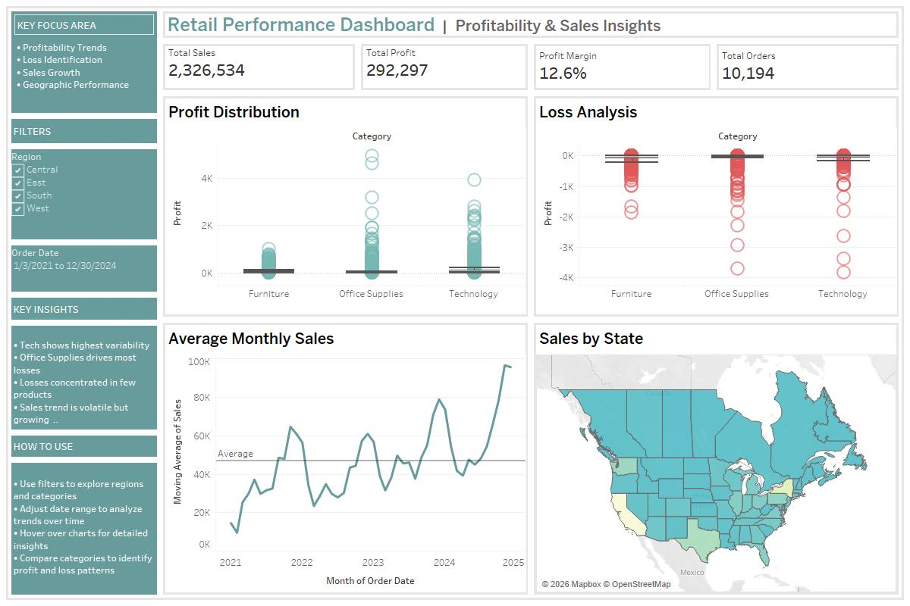

# Retail Performance Dashboard

This Tableau project analyzes retail sales, profitability, and geographic performance using the Sample Superstore dataset.

## Key Insights
- Technology shows highest profit variability  
- Office Supplies drives most losses  
- Sales trend is volatile but growing  
- Revenue is concentrated in a few states  

##  Files Included
-  Tableau Dashboard: `Retail Dashboard Working Copy.twbx`
-  Dashboard Preview: `Dashboard 2.jpg`

##  Tools Used
- Tableau  
- Data Visualization  
- Business Analysis  

##  Dashboard Preview

