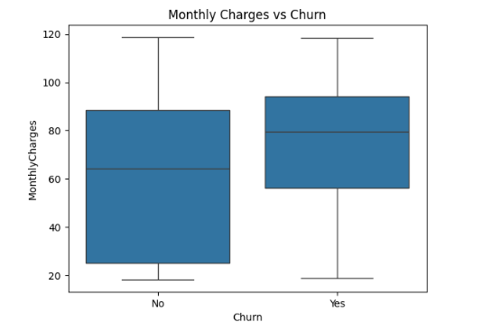
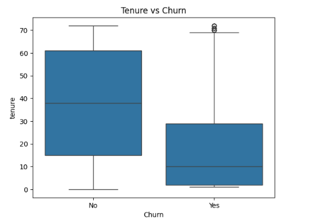

# Mahin Portfolio

This repository showcases my Business Analytics projects focused on data visualization, exploratory data analysis, and business insights.

---

## Projects

---

### 1. Retail Performance Dashboard (Tableau)

**Description**  
Analyzed retail sales, profit, and geographic performance using Tableau to identify key business trends.

**Key Insights**
- Technology category shows the highest profit variability  
- Office Supplies drives most losses  
- Sales show overall growth despite fluctuations  
- Revenue is concentrated in a few states  

**Tools Used**
- Tableau  

**Files**
- `retail-performance-dashboard.twbx`
- `dashboard.png`

**Preview**

---

### 2. Customer Churn Analysis (Python)

**Description**  
Performed exploratory data analysis on telecom customer data to identify churn patterns and business drivers.

**Key Insights**
- ~26.5% of customers have churned  
- Month-to-month customers have highest churn  
- Higher monthly charges increase churn risk  
- New customers are most likely to churn  

**Business Recommendations**
- Encourage long-term contracts  
- Review pricing for high-cost customers  
- Focus retention efforts on new customers  

**Tools Used**
- Python  
- Pandas  
- Seaborn  
- Matplotlib  

**Files**
- `customer_churn_analysis.ipynb`
- `churn_contract.png`
- `churn_tenure.png`

**Key Visualizations**

Churn by Contract Type  

Tenure vs Churn  

---

## Tools & Skills

- Data Visualization (Tableau)
- Python (Pandas, Matplotlib, Seaborn)
- Business Analysis
- Data Cleaning & Exploration

---

## About

This portfolio demonstrates my ability to:
- Analyze real-world datasets  
- Build dashboards and visualizations  
- Translate data into business insights  
- Communicate findings clearly  

---

## How to Use

1. Open Tableau files using Tableau Desktop  
2. Open Python notebooks in Google Colab or Jupyter  
3. Run all cells to reproduce analysis  
