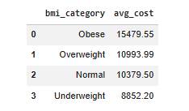
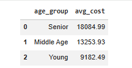

# Mahin Portfolio

This repository showcases my Business Analytics projects focused on data visualization, exploratory data analysis, and business insights.

---

# Projects

## 1. Retail Performance Dashboard (Tableau)

### Description
Analyzed retail sales, profitability, and geographic performance using Tableau to identify key business trends and support decision-making.

### Key Insights
- Technology category shows the highest profit variability  
- Office Supplies drives the majority of losses  
- Sales show overall growth despite fluctuations  
- Revenue is concentrated in a small number of states  

### Tools Used
- Tableau  

### Files
- retail-performance-dashboard.twbx  
- dashboard.png  

### Preview

---

## 2. Customer Churn Analysis (Python)

### Description
Performed exploratory data analysis on telecom customer data to identify churn patterns and key drivers of customer retention.

### Key Insights
- Approximately 26.5% of customers have churned  
- Month-to-month contracts show the highest churn rate  
- Higher monthly charges are associated with increased churn  
- New customers are more likely to churn  

### Business Recommendations
- Encourage long-term contracts to improve retention  
- Review pricing strategies for high-cost customers  
- Focus retention efforts on new customers  

### Tools Used
- Python  
- Pandas  
- Seaborn  
- Matplotlib  

### Files
- customer_churn_analysis.ipynb  
- churn_contract.png  
- churn_tenure.png  

### Key Visualizations

#### Churn by Contract Type

#### Tenure vs Churn

---

## 3. Healthcare Cost Analysis (Python + SQL)

### Description
Analyzed healthcare insurance data to understand how lifestyle and demographic factors impact medical costs. SQL queries were used to generate aggregated insights.

### Key Insights
- Smokers incur significantly higher medical costs than non-smokers  
- Obese individuals have the highest average healthcare expenses  
- Medical costs increase with age, with seniors incurring the highest costs  

### Tools Used
- Python  
- Pandas  
- SQLite  
- SQL  

### Files
- healthcare_sql_analysis.ipynb  
- smoking_cost.png  
- bmi_cost.png  
- age_cost.png  

### Key Visualizations

#### Smoking Impact

Smokers incur substantially higher medical costs compared to non-smokers.

#### BMI Impact

Higher BMI categories are associated with increased healthcare expenses.

#### Age Impact

Older age groups have higher average medical costs.

---

# Tools & Skills

- Data Visualization (Tableau)  
- Python (Pandas, Matplotlib, Seaborn)  
- SQL (Aggregations, CASE statements, grouping)  
- Business Analysis  
- Data Cleaning & Exploration  

---

# About

This portfolio demonstrates my ability to:

- Analyze real-world datasets  
- Build dashboards and visualizations  
- Translate data into actionable business insights  
- Communicate findings clearly and effectively  

---

# How to Use

- Open Tableau files using Tableau Desktop  
- Open Python notebooks in Google Colab or Jupyter Notebook  
- Run all cells to reproduce analysis and results  
