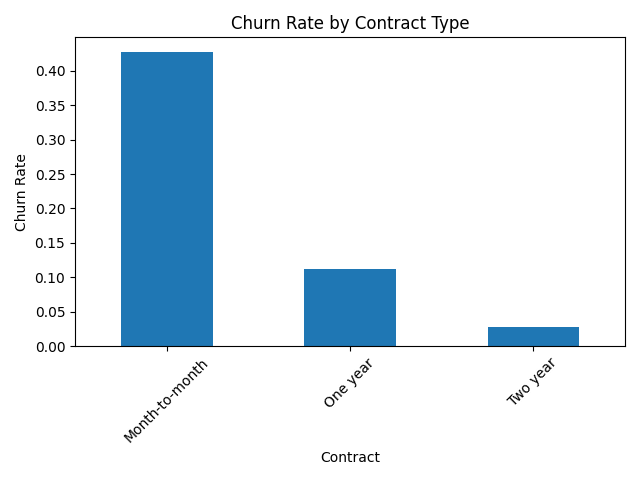
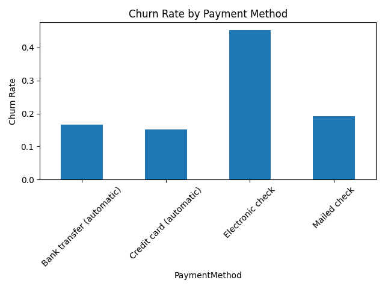
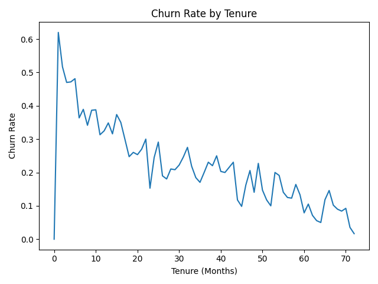

# Customer Churn Analysis (End-to-End Business Analyst Project)

## Project Overview
This project analyzes customer churn behavior to identify key drivers of customer attrition and provide actionable retention recommendations.

The analysis was performed using Python and SQL, focusing on customer contracts, tenure, and payment behavior.

---

## Tools Used
- Python (Pandas, Matplotlib)
- SQL
- VS Code
- GitHub

---

## Dataset
- 7,043 customer records
- 21 customer features
- Includes:
  - Contract type
  - Payment method
  - Tenure
  - Monthly charges
  - Churn status

---

# Key Insights

## 1. Contract Type Is the Strongest Driver
- Month-to-month churn rate: **42.7%**
- One-year contract churn rate: **11.2%**
- Two-year contract churn rate: **2.8%**

### Business Insight
Customers on flexible month-to-month plans are significantly more likely to leave.

---

## 2. Early Customers Have Highest Risk
Customers in their first few months showed the highest churn rates.

### Business Insight
Retention campaigns should focus heavily on onboarding and early customer engagement.

---

## 3. Payment Method Impacts Churn
- Electronic check users had the highest churn rate (~45%)
- Automatic payment methods showed lower churn behavior

### Business Insight
Payment behavior may act as an early warning indicator for churn risk.

---

# Visualizations

## Contract Type vs Churn


---

## Payment Method vs Churn


---

## Tenure vs Churn


---

# SQL Analysis

Example SQL query used to analyze churn by contract type:

```sql
SELECT 
    Contract,
    COUNT(*) AS total_customers,
    SUM(CASE WHEN Churn = 'Yes' THEN 1 ELSE 0 END) AS churned_customers,
    ROUND(
        SUM(CASE WHEN Churn = 'Yes' THEN 1 ELSE 0 END) * 100.0 / COUNT(*), 
        2
    ) AS churn_rate
FROM churn_data
GROUP BY Contract
ORDER BY churn_rate DESC;
```

---

# Business Recommendations
- Incentivize customers to move toward long-term contracts
- Launch retention campaigns during first 3–6 months
- Encourage automatic payment enrollment
- Monitor electronic check users as high-risk churn segments

---

# Outcome
This project demonstrates:
- Data cleaning
- Exploratory data analysis
- Business insight generation
- SQL querying
- Data visualization
- End-to-end analytical workflow
