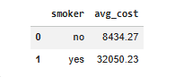

# Healthcare Cost Analysis

## Project Overview

This project analyzes healthcare cost patterns and demographic risk factors using Python-based exploratory data analysis and visualization.

The purpose of the analysis is to identify which customer characteristics are associated with higher medical charges and explain the business implications of those cost drivers.

---

## Tools Used

- Python
- Pandas
- Matplotlib
- Jupyter Notebook
- VS Code

---

## Analysis Focus Areas

The project analyzes relationships between healthcare charges and:

- Age
- BMI
- Smoking status

---

## Key Insights

### Smoking Status Was a Major Cost Driver

Customers identified as smokers showed substantially higher healthcare charges compared with non-smokers.

### BMI Was Associated with Higher Charges

Higher BMI levels were linked with increased medical costs, suggesting that health risk indicators may affect cost exposure.

### Age Influenced Healthcare Spending

Healthcare charges generally increased across older customer groups.

---

## Visualizations

### Age vs Healthcare Cost

### BMI vs Healthcare Cost

### Smoking vs Healthcare Cost

---

## Business Recommendations

- Use health-risk segmentation to identify higher-cost customer groups
- Support preventive wellness initiatives for high-risk populations
- Monitor cost drivers such as smoking status, BMI, and age for pricing and planning decisions

---

## Project Outcome

This project demonstrates:

- Exploratory data analysis
- Risk factor analysis
- Data visualization
- Business insight generation
- Analytical storytelling
