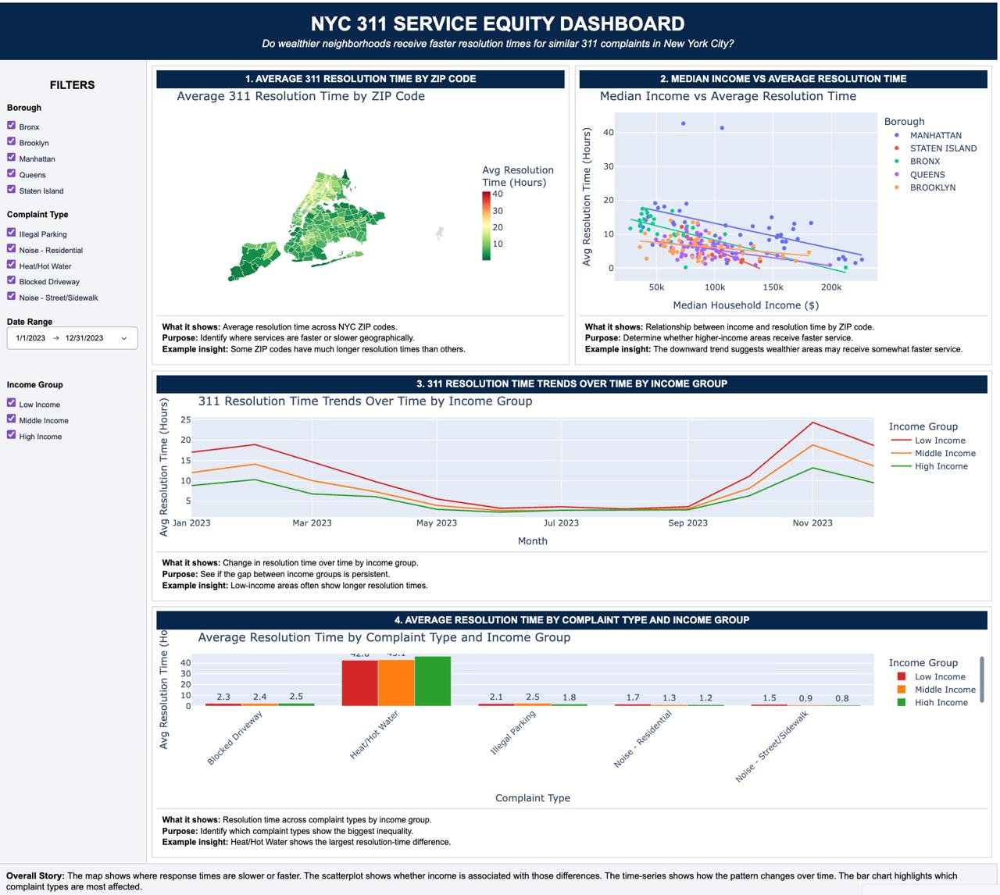

# NYC 311 Service Equity Dashboard

## Overview
This project analyzes whether wealthier neighborhoods in New York City receive faster 311 complaint resolution times.

The dashboard combines NYC 311 service request data with Census median household income data at the ZIP code level. The goal is to identify whether service resolution time differs across income groups, boroughs, ZIP codes, and complaint types.

## Guiding Question
Do wealthier neighborhoods receive faster resolution times for similar 311 complaints in New York City?

## Dashboard Preview


## Key Visualizations
1. Average 311 Resolution Time by ZIP Code  
2. Median Income vs Average Resolution Time  
3. Resolution Time Trends Over Time by Income Group  
4. Average Resolution Time by Complaint Type and Income Group  

## Key Insights
- Higher-income ZIP codes show a slight tendency toward faster resolution times.
- Low-income areas often experience longer resolution times over time.
- Heat/Hot Water complaints show the largest average resolution times.
- Geographic differences suggest that service speed varies across NYC neighborhoods.

## Tools Used
- Python
- Pandas
- Plotly
- Dash
- NYC Open Data
- U.S. Census ACS Income Data

## Files
- `nyc_311_service_equity_dashboard.ipynb` — notebook with data cleaning, analysis, and dashboard code
- `nyc_311_service_equity.jpg` — final dashboard screenshot

## How to Run
```bash
pip install pandas plotly dash statsmodels nbformat
